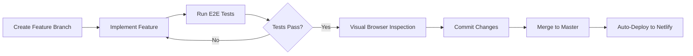

# Trivia Cards

A web-based card game where players arrange cards in order based on various dimensions — test your knowledge of years, prices, speeds, heights, populations, and 20+ more categories!

🎮 **[Play Now](https://avi-trivia.netlify.app)** | 📂 **[GitHub Repository](https://github.com/avi-otterai/trivia)**

[](https://app.netlify.com/projects/avi-trivia/deploys)


---

## 🎮 How It Works

1. Cards appear with a subject (person, place, thing) and a hidden value
2. Drag and drop cards into the correct order based on the selected dimension
3. Get it right → keep your streak going!
4. Get it wrong → lose a life (you have 3)
5. Try to beat your high score!

---

## 🚀 Quick Start

### Prerequisites

Make sure you have [Node.js](https://nodejs.org/) installed (v18 or higher recommended).

### Installation

```bash
# Clone the repository
git clone https://github.com/YOUR_USERNAME/trivia.git
cd trivia

# Install dependencies
npm install
```

### Development

```bash
# Start the development server
npm run dev
```

Then open [http://localhost:3000](http://localhost:3000) in your browser.

### Build for Production

```bash
# Create a production build
npm run build

# Serve the production build locally
npm start
```

---

## 🧪 Testing

This project uses **Playwright** for end-to-end (E2E) testing. Tests ensure UI interactions work correctly before deployment.

> ⚠️ **ALWAYS run tests before deploying to production!** Pushing untested code to `master` will auto-deploy to Netlify.

### Running Tests

```bash
# Run all tests (headless)
npm test

# Run tests with visible browser
npm run test:headed

# Run tests in interactive UI mode (recommended for debugging)
npm run test:ui

# Run tests in debug mode with step-through
npm run test:debug

# View the HTML test report
npm run test:report
```

### Running Tests with Existing Dev Server

If you already have the dev server running on a different port:

```bash
# Start dev server in one terminal
npm run dev

# In another terminal, run tests pointing to the correct port
PLAYWRIGHT_BASE_URL=http://localhost:3001 PLAYWRIGHT_SKIP_WEBSERVER=true npm test
```

### Test Coverage

The E2E test suite covers **40+ test cases** across desktop and mobile platforms:

#### Desktop Tests (`game.spec.ts`)

| Category | Test Cases | Key Files to Read |
|----------|------------|-------------------|
| **Instructions Screen** | Display title, dimension tiles, highscore | `components/instructions.tsx`, `components/game.tsx` |
| **Dimension Selection** | Click Year/Price/Speed to start game | `components/instructions.tsx`, `lib/dimensions.ts` |
| **Game Board** | Next/played areas, card counts, exit button | `components/board.tsx`, `components/next-item-list.tsx` |
| **Drag & Drop** | Card placement, new card generation | `components/board.tsx`, `lib/useAutoMoveSensor.ts` |
| **Lives System** | Initial 3 hearts, hearts after placement | `components/hearts.tsx`, `components/board.tsx` |
| **Card Display** | Labels and descriptions visible | `components/item-card.tsx` |
| **Highscore Persistence** | localStorage save/load | `components/game.tsx` |
| **Accessibility** | Focusable buttons, accessible names | `components/instructions.tsx` |

#### Mobile Tests (`mobile.spec.ts`)

| Category | Test Cases | Devices |
|----------|------------|---------|
| **Touch Interactions** | Tap tiles, tap exit, scroll tiles | iPhone 14, Pixel 7 |
| **Responsive Layout** | No horizontal scroll, cards fit viewport | iPhone 14, Pixel 7 |
| **Touch Drag & Drop** | Drag cards with touch gestures | iPhone 14, Pixel 7 |
| **Touch Targets** | Buttons ≥44px, cards large enough | iPhone 14, Pixel 7 |
| **Orientation** | Portrait and landscape modes | iPhone 14, Pixel 7 |
| **Text Readability** | Font sizes, no truncation | iPhone 14, Pixel 7 |
| **Performance** | Load times on mobile | iPhone 14, Pixel 7 |

### Test File Structure

```
e2e/
├── game.spec.ts       # Desktop E2E tests
└── mobile.spec.ts     # Mobile-specific tests (iPhone, Android)

playwright.config.ts   # Playwright configuration (multi-device)
```

### Running Mobile Tests

```bash
# Run all tests (desktop + mobile)
npm test

# Run only mobile tests (iPhone + Android)
npm test -- --project="Mobile Chrome" --project="Mobile Safari"

# Run only iPhone tests
npm test -- --project="Mobile Safari"

# Run only Android tests  
npm test -- --project="Mobile Chrome"
```

### Key Test Scenarios

| Test | What It Verifies |
|------|------------------|
| `should display instructions and dimension tiles on load` | App loads and shows 25 dimension buttons |
| `should start game when clicking Year dimension` | Clicking dimension starts the game |
| `should be able to drag card from next to played area` | Drag-and-drop works (keyboard-based for react-beautiful-dnd) |
| `should start with 3 hearts` | Lives system initializes correctly |
| `should reload page when exit button clicked` | Exit button functionality |
| `should save new highscore to localStorage` | Score persistence across sessions |

### Troubleshooting: Playwright Browser Issues

If tests fail with `"Executable doesn't exist"` or architecture mismatch errors (especially on Apple Silicon Macs):

```bash
# Clear Playwright cache and reinstall browsers for your architecture
rm -rf ~/Library/Caches/ms-playwright
npx playwright install
```

If you still have issues, try running tests in headed mode as a workaround:

```bash
npm run test:headed
```

---

## 🔄 Development Workflow (Best Practices)

> ⚠️ **IMPORTANT:** Always follow this workflow to prevent deploying broken code!

### Before Starting Any New Feature

```bash
# 1. Check your current branch
git branch

# 2. Check if branch is clean (no uncommitted changes)
git status

# 3. If on master or unrelated branch, create a new feature branch
git checkout -b feature/your-feature-name

# 4. If branch has uncommitted changes, either commit or stash them
git stash  # or commit
```

### Development Cycle



### Step-by-Step Workflow

#### 1️⃣ Create a Feature Branch
```bash
git checkout master
git pull origin master
git checkout -b feature/my-new-feature
```

#### 2️⃣ Implement the Feature
- Make your code changes
- Test manually in the browser during development

#### 3️⃣ Run E2E Tests
```bash
# Run all tests
npm test

# Or run in headed mode to watch
npm run test:headed
```

#### 4️⃣ Visual Browser Inspection
Before deploying, manually verify key user flows in the browser:
- [ ] App loads without errors
- [ ] Dimension tiles are clickable
- [ ] Game starts and cards display correctly
- [ ] Drag and drop works
- [ ] Hearts decrease on wrong answers
- [ ] Game over screen appears at 0 lives
- [ ] High score is saved

#### 5️⃣ Commit and Push
```bash
git add -A
git commit -m "feat: Description of your feature"
git push origin feature/my-new-feature
```

> 💡 **Tip:** If you encounter GPG signing errors, use `--no-gpg-sign`:
> ```bash
> git commit --no-gpg-sign -m "feat: Description of your feature"
> ```

#### 6️⃣ Merge to Master (Deploy)
```bash
# Ensure tests pass one more time
npm test

# Merge to master
git checkout master
git merge feature/my-new-feature

# Push to trigger Netlify auto-deploy
git push origin master
```

### Pre-Deployment Checklist

Before merging to `master`, verify:

- [ ] ✅ All E2E tests pass (`npm test`)
- [ ] ✅ No linting errors (`npm run lint`)
- [ ] ✅ Visual inspection in browser completed
- [ ] ✅ Feature works on mobile viewport (resize browser)
- [ ] ✅ No console errors in browser DevTools
- [ ] ✅ Commit messages are clear and descriptive

---

## 📁 Project Structure

```
trivia/
├── components/       # React components (game, board, cards, etc.)
├── e2e/              # Playwright E2E tests
├── lib/              # Utility functions and game logic
├── pages/            # Next.js pages and routes
├── public/           # Static assets and card data (JSON files)
├── styles/           # SCSS stylesheets
├── types/            # TypeScript type definitions
├── playwright.config.ts  # Playwright configuration
└── package.json      # Dependencies and scripts
```

---

## 🎯 Available Dimensions

The game includes **25 playable dimensions**:

| Category | Dimensions |
|----------|------------|
| **Core** | Year, Price, Speed, Height, Weight, Population |
| **Science** | Lifespan, Distance, Temperature, Area, Depth, Calories |
| **Entertainment** | Duration, Box Office, Album Sales, Game Sales, Oscars, Spotify Streams |
| **Misc** | Net Worth, Followers, Stadium Capacity, Horsepower, Elevation, Year Founded, Prep Time |

---

## 🛠️ Available Scripts

| Command | Description |
|---------|-------------|
| `npm run dev` | Start development server |
| `npm run build` | Build for production |
| `npm start` | Serve production build |
| `npm run lint` | Check for linting errors |
| `npm run lint-fix` | Fix linting errors automatically |
| `npm run format` | Format code with Prettier |
| `npm test` | Run Playwright E2E tests (headless) |
| `npm run test:ui` | Run tests in interactive UI mode |
| `npm run test:headed` | Run tests with visible browser |
| `npm run test:debug` | Debug tests with step-through |
| `npm run test:report` | View HTML test report |

---

## 🌐 Deploying to Netlify

> ⚠️ **WARNING:** Pushing to `master` automatically deploys to production! Always run tests first!

### Option 1: Deploy via Netlify Dashboard (Recommended)

1. **Push your code to GitHub**
   ```bash
   git add .
   git commit -m "Initial commit"
   git push origin master
   ```

2. **Connect to Netlify**
   - Go to [netlify.com](https://netlify.com) and sign up/log in
   - Click **"Add new site"** → **"Import an existing project"**
   - Choose **GitHub** and authorize Netlify
   - Select your `trivia` repository

3. **Configure Build Settings**
   - **Build command:** `npm run build`
   - **Publish directory:** `.next`
   - Click **"Deploy site"**

4. **Done!** 🎉
   - Netlify will build and deploy your site
   - You'll get a URL like `https://your-site-name.netlify.app`
   - Every push to `master` will trigger an automatic redeploy!

### Option 2: Deploy via Netlify CLI

```bash
# Install Netlify CLI globally
npm install -g netlify-cli

# Login to Netlify
netlify login

# Initialize your site (run from project root)
netlify init

# Deploy to production
netlify deploy --prod
```

---

## 🔄 Auto-Deploy on GitHub Push

Once you've connected your repository to Netlify (via the dashboard), auto-deploy is **enabled by default**. Here's what happens:

| Event | Action |
|-------|--------|
| Push to `master` | ⚡ Automatically deploys to production |
| Pull Request | Creates a deploy preview with unique URL |
| Push to other branches | Creates branch deploy (optional) |

### Customizing Auto-Deploy

In your Netlify dashboard:

1. Go to **Site settings** → **Build & deploy** → **Continuous Deployment**
2. Configure options:
   - **Production branch:** Which branch triggers production deploys
   - **Deploy previews:** Enable/disable PR previews
   - **Branch deploys:** Deploy specific branches

---

## ⚙️ Environment Variables

If you need environment variables (for future features like API integration):

1. **Netlify Dashboard:** Site settings → Environment variables
2. **Local development:** Create a `.env.local` file:
   ```env
   NEXT_PUBLIC_API_URL=https://api.example.com
   ```

> ⚠️ Never commit `.env.local` to git — it's already in `.gitignore`

---

## 🤝 Contributing

1. Fork the repository
2. Create a feature branch (`git checkout -b feature/amazing-feature`)
3. Make your changes and **run tests** (`npm test`)
4. Commit your changes (`git commit -m 'Add amazing feature'`)
5. Push to the branch (`git push origin feature/amazing-feature`)
6. Open a Pull Request

> 💡 **Tip:** Run `npm run test:ui` during development to catch issues early!

---

## 📝 Adding New Dimensions

Card data is stored in `public/items-{dimension}.json` files. See `public/guidelines.md` for the format and guidelines on creating new dimension datasets.

---

## 📄 License

This project is open source under the MIT License — see [LICENSE.md](LICENSE.md) for details.

---

**Have fun playing!** 🎲
